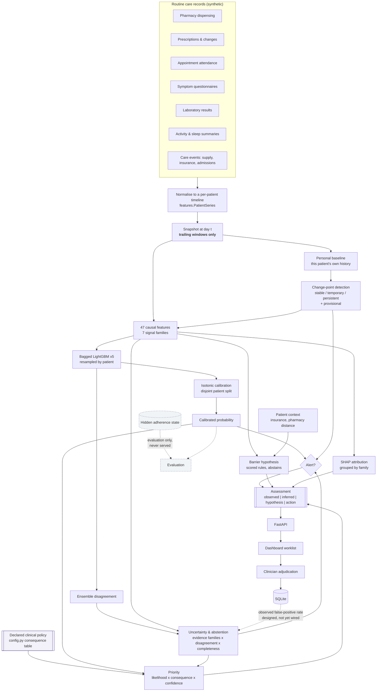

# Architecture

## Layers

## The boundary that matters most

Three things are kept structurally separate, and the separation is enforced rather than documented:

**Observation vs inference vs hypothesis.** Every assessment is a four-key object — `observed`,
`inferred`, `hypothesis`, `action` — and the keys are rendered in that order in the interface with
visually distinct left rules. `test_observed_inferred_hypothesis_are_separate_keys` fails the build
if a model estimate appears inside the observed block. The purpose is to make it structurally
difficult for a reader to mistake an inference for a fact.

**Learned vs declared.** The model estimates likelihood. Clinical severity, alert thresholds and
priority tiers live in `dosesense/config.py` and are exposed at `GET /api/config`. A care team must
be able to change what the system cares about without retraining it, and an auditor must be able to
read the policy without reading the model.

**Ground truth vs serving.** The hidden adherence trajectory is written to a separate file, loaded
only by the evaluation path, and the API loads the cohort with `include_ground_truth=False`. The
generator's archetype label is stripped from every patient payload.
`test_ground_truth_never_served` walks every string in 25 patient payloads asserting no latent
state name appears.

## Module responsibilities

| Module | Responsibility | Depends on |
|---|---|---|
| `config.py` | Declared clinical policy, thresholds, taxonomies, language guardrails | nothing |
| `datagen.py` | Causal simulator, 12 archetypes, hidden trajectories | config |
| `changepoint.py` | Personal-baseline segmentation, temporary vs persistent | config |
| `baseline.py` | Faithful PDC / MPR comparator | — |
| `features.py` | 47 causal features, observed facts, family coverage | config, baseline, changepoint |
| `panel.py` | Snapshot panel, labelling from hidden state, patient-level splits | config, baseline, features |
| `model.py` | Bagged calibrated ensemble, persistence, importance | config, features |
| `barriers.py` | Scored barrier hypotheses with abstention | config |
| `risk.py` | Evidence strength, confidence, abstention, priority | config |
| `explain.py` | SHAP grouped by family, plain-language names | features |
| `evaluate.py` | Metrics, calibration, lead time, burden, ablation, subgroups | config, features, panel |
| `pipeline.py` | Assessment assembly, cohort scoring, serving engine | all of the above |

`dosesense/` has no dependency on FastAPI, the dashboard, or any CLI. The engine is importable on its
own, which is what makes the test suite able to exercise it without a server.

## Request path

The engine scores the cohort once at start-up and holds current assessments, probability
trajectories and evidence timelines in memory. Scoring 600 patients takes ~35 seconds; doing it per
request would make the interface feel broken.

This does not scale to a real panel and is called out in `docs/limitations.md`. The production shape
is batch scoring to a store with the API reading from it — a contained change, since `pipeline.py`
already separates scoring from querying.

## Reuse beyond adherence

The generic spine — multi-signal ingestion, personal baselines, change detection, evidence
timelines, calibrated uncertainty with abstention, consequence-weighted prioritisation,
grouped explanation, human feedback — carries no adherence-specific logic. Domain specifics are
confined to `config.py` (conditions, medications, consequence weights), the feature definitions, and
the barrier rules.

The shape recurs across problems where indirect signals must be fused into a triage decision under
uncertainty: medicine supply-chain shortage detection, insider-threat behavioural analytics,
procurement anomaly review. In each, the task is to separate a meaningful shift from normal
variation, quantify confidence, and hand a human a ranked, explained queue.
